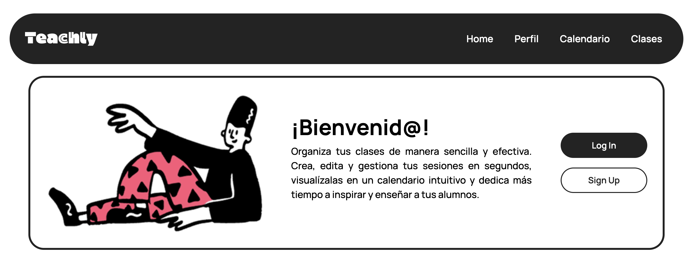

# 📚 Aplicación Web de Gestión y Planificación Docente

## 📝 Descripción del proyecto

Este proyecto consiste en el desarrollo de una **aplicación web full stack orientada a docentes**, diseñada para facilitar la **gestión, organización y planificación de clases de forma visual, intuitiva y eficiente**.

La plataforma permite a los profesores:

- Crear, editar y eliminar clases.
- Asociar materiales complementarios a cada clase (documentos, enlaces, recursos digitales, etc.).
- Visualizar todas las clases en un **calendario interactivo**, que facilita la planificación temporal.
- Modificar eventos de forma sencilla y mantener la organización docente siempre actualizada.

El objetivo principal es **mejorar la planificación académica**, reduciendo la carga administrativa y ofreciendo una experiencia visual clara y cómoda para el profesorado.

---

## 🎯 Objetivos del proyecto

### Objetivo general
Desarrollar una aplicación web que permita a los docentes planificar y gestionar sus clases y materiales de manera visual, estructurada y eficiente.

### Objetivos específicos
- Facilitar la creación y gestión de clases desde una interfaz intuitiva.
- Centralizar los materiales educativos asociados a cada clase.
- Implementar un calendario interactivo para visualizar la planificación temporal.
- Trabajar con variables de entorno para una configuración segura y escalable.

---
## 🖌️ Diseño mobile first y responsive


---

## 🛠️ Tecnologías utilizadas

### Frontend
- HTML5
- CSS3
- JavaScript (ES6+)
- React
- Vite (o Create React App)
- Librerías de apoyo (calendario, UI, etc.)

### Backend
- Node.js
- Express.js
- Arquitectura MVC
- Variables de entorno con `dotenv`
- Base de datos (según implementación: MongoDB, PostgreSQL, etc.)

### Otras herramientas
- Git y GitHub
- npm
- REST API
- JSON

---

## 📁 Estructura del proyecto

```bash
my-project/
│
├── backend/
│   ├── src/
│   │   ├── config/         
│   │   ├── controllers/    
│   │   ├── models/        
│   │   ├── routes/         
│   │   └── app.js    
│   ├── package.json
│   ├── .env                
│
├── frontend/
│   ├── public/           
│   ├── src/               
│   ├── package.json
│   ├── vite.config.js      
│   └── .env                
│
├── Dockerfile
├── .env.example
├── package.json
├── package-lock.json
└── README.md
```
## 🚀 Instalación y puesta en marcha
### 💻 Instalación del frontend
1. Accede a la carpeta del backend:
```bash
cd backend
```
2. Instala las dependencias:
```bash
npm install
```
3. Crea un archivo .env con las variables necesarias, por ejemplo:
```env
PORT=3000
DATABASE_URL=tu_url_de_base_de_datos
```
4. Arranca el servidor:
```bash
npm start
```
o en modo desarrollo:
```bash
npm run dev
```
### 💻 Instalación del frontend

1. Accede a la carpeta del frontend:
```bash
cd frontend
```
2. Instala las dependencias:
```bash
npm install
```
3. Crea un archivo .env para el frontend, por ejemplo:
```env
VITE_API_URL=http://localhost:3000
```
4. Inicia la aplicación:
```bash
npm run dev
```

## 🗓️ Funcionalidades principales

📌 Creación, edición y eliminación de clases.

📂 Asociación de materiales a cada clase.

🗓️ Visualización de clases en un calendario interactivo.

🔄 Modificación rápida de eventos desde el calendario.

🌐 Comunicación frontend-backend mediante API REST.

## 📌 Estado del proyecto
🟡 En desarrollo / Proyecto académico

## 🔗 Link al despliegue
```url
https://proyecto-final-clases-1.onrender.com/
```

## 👤 Autora
 
Rebeca Díaz-Montenegro Sánchez: 
   - Linkdin: https://www.linkedin.com/in/rebeca-diaz-montenegro-s%C3%A1nchez/
